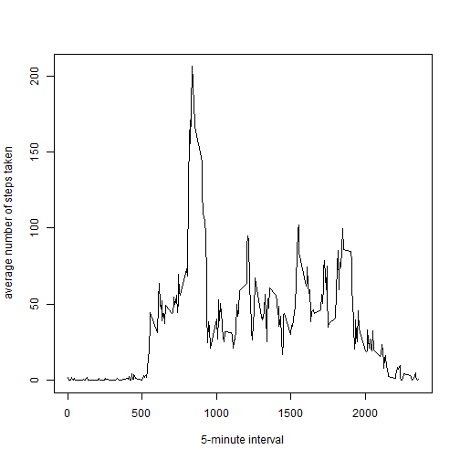

Reproducible Research: Peer Assessment 1
==============================================================================================
Julie L. Steyn

This document uses the activity dataset which can be found at https://d396qusza40orc.cloudfront.net/repdata%2Fdata%2Factivity.zip contained in this directory, and assumes the dataset has been unzipped into the current working directory.

### Loading and preprocessing the data


```r
# load the dataset
activity <- read.csv("activity.csv")
head(activity)
```

```
##   steps       date interval
## 1    NA 2012-10-01        0
## 2    NA 2012-10-01        5
## 3    NA 2012-10-01       10
## 4    NA 2012-10-01       15
## 5    NA 2012-10-01       20
## 6    NA 2012-10-01       25
```

```r
str(activity)
```

```
## 'data.frame':	17568 obs. of  3 variables:
##  $ steps   : int  NA NA NA NA NA NA NA NA NA NA ...
##  $ date    : Factor w/ 61 levels "2012-10-01","2012-10-02",..: 1 1 1 1 1 1 1 1 1 1 ...
##  $ interval: int  0 5 10 15 20 25 30 35 40 45 ...
```


```r
# format the date column
activity$date <- as.Date(activity$date, format = "%Y-%m-%d")
```


```r
# process the data

# total steps per day
total_steps <- aggregate(activity$steps, by = list(activity$date), sum)
names(total_steps)[1] <- "date"
names(total_steps)[2] <- "steps"

# total steps per interval
total_interval <- aggregate(activity$steps, by = list(activity$interval), sum, na.rm = TRUE)
names(total_interval)[1] <- "interval"
names(total_interval)[2] <- "steps"

# mean steps per interval
mean_interval <- aggregate(activity$steps, by = list(activity$interval), mean, na.rm = TRUE)
names(mean_interval)[1] <- "interval"
names(mean_interval)[2] <- "steps"
```


### 1. What is mean total number of steps taken per day?

#### 1.1 Make a histogram of the total number of steps taken each day

```r
hist(total_steps[,2], main = "Histogram of the total number of steps taken each day (ignoring NA)", 
     xlab = "total steps taken each day", col="#CCCCFF")
```

 

#### 1.2 Calculate and report the mean and median total number of steps taken per day

```r
calcmean <- mean(total_steps[,2], na.rm = TRUE)
calcmean
```

```
## [1] 10766
```

```r
calcmedian <- median(total_steps[,2], na.rm = TRUE)
calcmedian 
```

```
## [1] 10765
```

The mean is 1.0766 &times; 10<sup>4</sup> and the median is 10765.


### 2. What is the average daily activity pattern?

#### 2.1 Make a time series plot (i.e. type = "l") of the 5-minute interval (x-axis) and the average number of steps taken, averaged across all days (y-axis)

```r
plot(mean_interval$interval, mean_interval$steps, type = "l")
```

 

#### 2.2 Which 5-minute interval, on average across all the days in the dataset, contains the maximum number of steps?

```r
maxsteps <- max(mean_interval$steps)
maxsteps
```

```
## [1] 206.2
```

```r
whichinterval <- mean_interval[which.max(mean_interval$steps), 1]
whichinterval
```

```
## [1] 835
```

The 5-minute interval containing the maximum number of steps is 835 and the maximum number of steps is 206.1698.


### 3. Imputing missing values

#### 3.1 Calculate and report the total number of missing values in the dataset (i.e. the total number of rows with NAs)

```r
nummissing <- sum(is.na(activity$steps))
nummissing
```

```
## [1] 2304
```
The number of missing values is 2304.

#### 3.2 Devise a strategy for filling in all of the missing values in the dataset. The strategy does not need to be sophisticated. For example, you could use the mean/median for that day, or the mean for that 5-minute interval, etc.

Using the mean for the interval as a replacement for missing values:

```r
# new df with new column of mean per interval
new_activity <- merge(activity, mean_interval, by = "interval", sort = FALSE)
# sort on date and interval
new_activity <- new_activity[with(new_activity, order(date, interval)), ]  
# assign names to columns
names(new_activity)[2] <- "steps"
names(new_activity)[4] <- "mean.steps"
# replace NA with mean.steps
new_activity$steps[is.na(new_activity$steps)] <- new_activity$mean.steps[is.na(new_activity$steps)]
# round-off number of steps to 0 decimal places
new_activity$steps <- round(new_activity$steps, digits = 0) 
# remove the mean.steps column
new_activity$mean.steps <- NULL
```
  
#### 3.3 Create a new dataset that is equal to the original dataset but with the missing data filled in.

```r
new_activity <- new_activity[, c(2, 3, 1)]
head(new_activity)
```

```
##     steps       date interval
## 1       2 2012-10-01        0
## 63      0 2012-10-01        5
## 128     0 2012-10-01       10
## 205     0 2012-10-01       15
## 264     0 2012-10-01       20
## 327     2 2012-10-01       25
```

#### 3.4 Make a histogram of the total number of steps taken each day and Calculate and report the mean and median total number of steps taken per day. Do these values differ from the estimates from the first part of the assignment? What is the impact of imputing missing data on the estimates of the total daily number of steps?

```r
new_total_steps <- aggregate(new_activity$steps, by = list(new_activity$date), sum)
names(new_total_steps)[1] <- "date"
names(new_total_steps)[2] <- "steps"
hist(new_total_steps[,2], main = "Histogram of the total number of steps taken each day (replacing NA)", xlab = "total steps taken each day", col="#CCCCFF")
```

 

Comparison of both Histograms:

```r
par(mfrow = c(1, 2))
hist(total_steps$steps, main = "(with NA)", xlab = "total number of steps taken each day", col="#CCCCFF")
hist(new_total_steps$steps, main = "(NA replaced)", xlab = "total number of steps taken each day", col="#CCCCFF")
```

 

```r
#na.rm is now redundant since all NA have been replaced
calcnewmean <- mean(new_total_steps[,2], na.rm = TRUE)
calcnewmean
```

```
## [1] 10766
```

```r
#na.rm is now redundant since all NA have been replaced
calcnewmedian <- median(new_total_steps[,2], na.rm = TRUE) 
calcnewmedian
```

```
## [1] 10762
```

The mean is 1.0766 &times; 10<sup>4</sup> and the median is 1.0762 &times; 10<sup>4</sup>.


### 4. Are there differences in activity patterns between weekdays and weekends?

#### 4.1 Create a new factor variable in the dataset with two levels - "weekday" and "weekend" indicating whether a given date is a weekday or weekend day.

```r
# new factor column with name of day of the week
new_activity$weekdays <- factor(format(new_activity$date, "%A")) 
# to view the values of the levels
levels(new_activity$weekdays)
```

```
## [1] "Friday"    "Monday"    "Saturday"  "Sunday"    "Thursday"  "Tuesday"  
## [7] "Wednesday"
```

```r
# replace the levels with weekday or weekend
levels(new_activity$weekdays) <- list(weekday = c("Monday", "Tuesday", "Wednesday", "Thursday", "Friday"), weekend = c("Saturday", "Sunday"))
```

#### 4.2 Make a panel plot containing a time series plot (i.e. type = "l") of the 5-minute interval (x-axis) and the average number of steps taken, averaged across all weekday days or weekend days (y-axis).

```r
# new dataset with mean across intervals
new_mean_interval <- aggregate(new_activity$steps, by = list(new_activity$weekdays, new_activity$interval), mean, na.rm = TRUE, na.action = NULL)
# assign names to columns
names(new_mean_interval)[1] <- "weekday"
names(new_mean_interval)[2] <- "interval"
names(new_mean_interval)[3] <- "mean.steps"
# new dataset 
head(new_mean_interval)
```

```
##   weekday interval mean.steps
## 1 weekday        0     2.2889
## 2 weekend        0     0.2500
## 3 weekday        5     0.4000
## 4 weekend        5     0.0000
## 5 weekday       10     0.1556
## 6 weekend       10     0.0000
```

```r
# panel plot of new dataset library(lattice)
library(lattice)
xyplot(new_mean_interval$mean.steps ~ new_mean_interval$interval | 
               new_mean_interval$weekday, layout = c(1, 2), type = "l", xlab = "Interval", ylab = "Number of steps")
```

 


